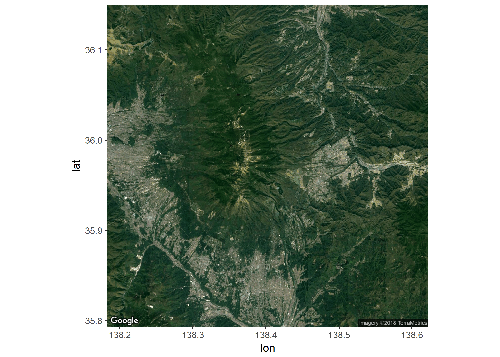
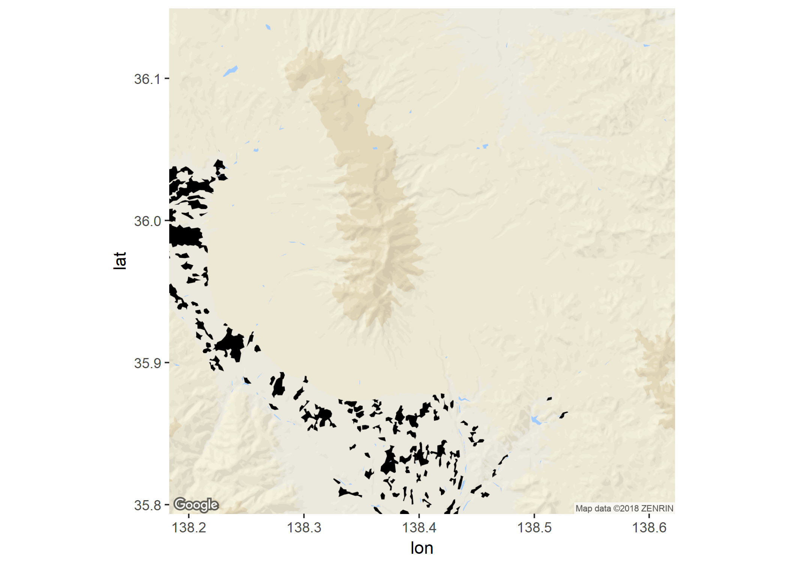

# 로지스틱 회귀에 기반한 기계학습을 활용한 매핑 - 일본 중부지방을 대상으로

## 1. 서론  
기계학습(Machine Learning)은 오늘날 영상, 의학, 게임 등 다양한 분야에서 주목받고 있다. 기계 학습은 고전적인 알고리즘과는 달리 프로그래머가 프로그램의 조건과 결과를 일일이 연결하지 않는다. 프로그래머는 대신 컴퓨터가 데이터를 어떻게 학습할지 결정한 후 데이터를 학습하여 추세에 반영하도록 유도한다. 다음은 Tom Mitchell이 언급한 기계학습의 유명한 정의다. 
  
'A computer program is said to learn from experience E with respect to some class of tasks T and performance measure P, if its performance at tasks in T, as measured by P, improves with experience E'  
'특정 작업 T의 성능이 성능 측정 방식 P에 의해 측정되고 경험 E에 의해 향상된다고 할 때, 컴퓨터 프로그램은 작업 T와 성능 측정 P에 관한 경험 E로부터 학습된다고 할 수 있다'(라가프 발리 · 디판잔 사카, 2017)  
  
기계학습은 특히 이미지를 인식하는 작업에 있어서 큰 장점을 가지고 있다. 사진에 나타난 대상이 무엇인지 판단하는 서비스 가운데 많은 수가 기계학습 알고리즘에 기반하고 있다. 뿐만 아니라 사용 가능한 기법 역시 다양하다. 베이지안 네트워크(Bayesian Networks), K-평균 군집화(K-Means Clustering), 결정 트리(Decision Tree) 등 이질적인 특성을 가진 다양한 기법이 기계학습에 속하므로, 프로그래머는 작업에 적합한 기법을 선택할 수 있다.  

본 연구에서는 지도학(Cartography) 분야에 기계학습을 적용하고자 한다. 위성 이미지를 입력(input)하면 간단한 지도를 출력(output)하는 모델을 구축하는 것이 본 연구의 목표이다. 일본을 학습 대상으로 선정한 것은 대한민국의 경우 구글(Google)과 정부 측의 지도 반출 관련 공방으로 인해 구글 지도가 제대로 서비스되지 못하는 실정이고, 따라서 구글맵 API와 ggmap 라이브러리를 활용하여 대한민국 지도를 취득하고 가공하는 작업이 불가능하기 때문이다. 이에 따라 본 연구에서는 일본의 중부 지역에 해당하는 경도 동경 138 - 140도, 위도 북위 37 - 35도 지역을 탐구 대상으로 한다. 이 탐구 지역의 범위 내에 훈련 집합(Training Set)이 되는 위성 이미지와 지도의 중심이 위치한다. 다음 그림에 탐구 지역을 보인다.
<center></center>

## 2. 탐구 계획  
학습은 위성 이미지의 픽셀을 지도의 각 범주에 대응시키는 방법으로 이루어지며, 이는 연속적인 대상을 이산적인 범주에 분류(Classification)하는 작업이므로, 위성 이미지를 입력으로 하고, 지도를 레이블(Label)로 설정한 지도학습(Supervised Learning)의 일종인 로지스틱 회귀(Logistic Regression)에 기반한 분류학습 알고리즘을 통해 구현된다.  

데이터는 경사 하강법(Gradient Descent)에 의해 모형에 적합될 수 있다. 경사 하강법은 비용함수(Cost Function)을 반복적으로 편미분해나가면서 비용함수가 최소가 되는 파라미터(Parameter)를 찾는 방법이다. 적합된 로지스틱 회귀식은 독립변수에 따라 더미 변수로 이루어진 종속변수에 분류하는 기준을 제시한다. 특히 본 연구에서 목표하는 모델의 학습 방식의 경우에는 종속변수가 인위적으로 조성된 거주 및 활동 지역/물/기타 지역으로, 그 개수가 두 개를 초과하므로 일대다(One vs Rest) 방식으로 이항 분류 문제로 변환된다. 독립변수는 위성 이미지에 속한 픽셀의 색이다.  

학습의 용이성을 위해 두 가지 조작을 거친다. 위성 이미지의 픽셀의 색을 그대로 독립변수로 사용하기는 어려우므로 픽셀의 R, G, B 값 각각을 독립변수로 설정한다. 또한 위성 이미지의 픽셀에 대응된 지도의 픽셀을 그 색에 따라 '인위적으로 조성된 지역'/'물'/'기타 지역' 세 가지로 분류하는 인위적 조작을 가한다.  

로지스틱 회귀를 통해 위성 이미지의 픽셀들을 지도의 각 범주에 분류하는 학습을 거치고 나면, 지도로 변환하고자 하는 위성 이미지를 입력하였을 때 이에 속하는 픽셀들을 지도의 각 범주에 학습된 알고리즘에 따라 분류할 수 있게 되고, 이로써 자동으로 위성 이미지만으로도 지도를 생성한다.  

본 연구에서는 파일을 두 개로 분리한다. 본 파일(Term.Rmd)에서는 데이터를 로드하여 그 데이터를 탐구하고, 또 다른 파일(generateData.Rmd)에서는 이를 위한 데이터를 생성한다.

## 3. 데이터 로드 및 가공  

### 1) 라이브러리
```{r library, message = FALSE, warning = FALSE}
require(grid) || install.packages("grid")
require(DT) || install.packages("DT")
require(dplyr) || install.packages("dplyr")
require(nnet) || install.packages("nnet")
require(pscl) || install.packages("pscl")
require(png) || install.packages("png")
```
작업에 필요한 라이브러리를 로드한다.

### 2) 데이터 확인
```{r check_data, message = FALSE, warning = FALSE, fig.width = 10}
rgb_data <- read.csv('./data/rgb_data.csv', 
                     head = TRUE) 
# read rgb_data.csv

rgb_data <- tbl_df(rgb_data)

unique_rgb_data <- unique(rgb_data[c("map_R", "map_G", "map_B")]) 
# extract unique rows from map RGB data
rgb_sample <- rgb(unique_rgb_data$map_R, unique_rgb_data$map_G, unique_rgb_data$map_B) 
# a set of unique rgb values from pixels

number_of_columns <- 20
length_of_matrix <- 0

while(length_of_matrix < length(rgb_sample))
{
  length_of_matrix <- length_of_matrix + number_of_columns
}
while(length(rgb_sample) < length_of_matrix)
{
  rgb_sample <- append(rgb_sample, NA)
}
# convert RGB vector into (unknown number of rows)x(number of columns) matrix

rgb_sample <- matrix(rgb_sample, byrow = TRUE, ncol = number_of_columns)
grid.raster(rgb_sample, interpolate = FALSE)
# draw a grid of colors
```
임의의 픽셀들에서 추출된 색들을 grid.raster() 함수를 사용하여 보인다. 이 가운데 하늘색 계열은 물, 검은색은 인공적으로 조성된 인간의 거주 및 활동 지역, 나머지 색들은 기타 지역(산, 오지 등 비거주지역)을 나타내는 것으로 간주하여 분류한다.

### 3) 데이터 분류
```{r classification, message = FALSE, warning = FALSE, fig.align = "center"}
rgb_data <- rgb_data %>% mutate(area = 
                                  if_else(map_R > 150 / 255 & map_G > 190 / 255 & map_B > 240 / 255, "water",
                                  if_else(map_R == 0 & map_G == 0 & map_B == 0, "artificial", "etc")))
# classify pixels into regions by color
DT::datatable(rgb_data)
```
지도의 픽셀들의 RGB 값은 연속적이므로, 분류를 단순화하기 위해 RGB 값에 따라 픽셀을 인위적으로 앞서 정한 범주에 분류한다. R > 150, G > 190, B > 240의 조건을 만족하는 픽셀은 하늘색 계열이므로 물, R = 0, G = 0, B = 0을 만족하는 픽셀은 검은색이므로 거주 및 활동 지역으로 분류한다. 다른 RGB값들을 가지는 픽셀은 나머지 지역으로 분류한다.  

## 4. 로지스틱 회귀
이제 데이터 가공을 마쳤으니 로지스틱 회귀를 통해 기계학습을 시행한다. 독립변수는 연속 변수로서 위성 이미지에 속하는 특정 픽셀의 R, G, B 값이고, 종속변수는 해당 픽셀에 대응되는 지도 이미지의 범주 분류(rgb_data$area)이다.
```{r logistic_regression, message = FALSE, warning = FALSE}
result <- multinom(area ~ satellite_R + satellite_G + satellite_B, data = rgb_data)
# perform logsitic regression
summary(result)
```
위와 같이 다항 로지스틱 회귀(Multinomial Logistic Regression)을 시행한 결과를 보인다. 다음으로는 head() 함수를 사용하여 각 행이 각각의 분류에 속할 확률을 보인다. 또, 결정계수(R^2) 값을 보인다.
```{r result_analysis, message = FALSE, warning = FALSE}
head(fitted(result))
pR2(result)
```
로지스틱 회귀의 결정계수를 계산하는 방법은 매우 다양한데, 이 가운데 McFadden's pseudo r-squared는 약 0.6961, Maximum Likelihood pseudo r-squared는 약 0.6663, Cragg and Uhler's pseudo r-squared 약 0.8399로 모두 높은 값을 보이고 있다.  

## 5. 실제 위성 이미지의 변환
4장에서 기계학습을 끝마쳤으므로 5장에서는 위성 이미지를 지도로 변환하는 작업을 수행할 것이다. predict() 함수를 사용하여 픽셀이 각 범주에 속할 확률을 구한 뒤, 속할 확률이 가장 높은 범주를 그 픽셀의 (지도에서의)범주로 정한다. 지도를 작성할 때에는, 본 연구에서 사용한 조작된 스타일의 구글 지도와 비슷하게 인위적으로 조성된 거주 및 활동 지역은 검은색(#000000), 물은 하늘색(#A3CCFF), 기타 지역은 베이지색(#F5F1DF)으로 나타내었다. 테스트를 위한 10개의 위성 이미지 가운데 처음 하나만을 입력해보았다. 



```{r predict_through_model, message = FALSE, warning = FALSE, echo = FALSE, fig.align = "center"}
map_maker <- function(learning_result, new_data)
{
  predict_result <- tbl_df(predict(learning_result, type="probs", newdata = new_data))
  area_result <- c()
  
  for(i in 1 : nrow(predict_result))
  {
    if(which.max(predict_result[i, ]) == 1) # '1' indicates 'artificial'
    {
      area_color <- "#000000"
    }
    else if(which.max(predict_result[i, ]) == 2) # '2' indicates 'etc'
    {
      area_color <- "#F5F1DF"
    }
    else # '3' indicates 'water'
    {
      area_color <- "#A3CCFF"
    }
    area_result <- append(area_result, area_color)
  }
  
  area_result <- matrix(area_result, nrow = 245, ncol = 241, byrow = FALSE)
  grid.raster(area_result, interpolate = FALSE)
}

test_satellite_rgb <- read.csv("./data/test_satellite_rgb2.csv")
map_maker(result, test_satellite_rgb)

```

'입력으로 사용한 위성 이미지' - '출력된 지도' - '해당 지점의 구글 지도' 순으로 나타낸다.

출력된 지도와 해당 지점의 구글 지도는 세세한 부분에서 차이를 보이고 있으나 세 가지 지역 범주의 전체적인 패턴은 비슷함을 확인한다. 기계학습에 의해 생성된 지도는 각 범주의 정확한 분포와 밀도가 정확하지는 않으나, 추세는 상당히 정확히 반영하고 있다. 이로써 당초 의도한 기계학습이 적절히 이루어졌음을 알 수 있다.

## 6. 결론 및 한계
  
### 1) 결론
본 연구에서는 기계학습을 통해 구축된 알고리즘으로 위성 이미지를 지도로 변환하는 방법을 보였다. 위성 이미지와 지도의 픽셀들을 추출하고, 로지스틱 회귀를 이용하여 위성 이미지의 픽셀을 지도의 범주에 분류하는 방법을 학습시킴으로써 모델을 구축하였고, 그 결과 상관계수와 같은 수치가 긍정적으로 나타으며, 결과물 역시 구글 지도와 비슷한 모습을 보임으로써 기계학습 알고리즘이 효과적이라고 평가할 수 있었다.  

### 2) 한계
그러나 범주를 세 가지로 나누어 모델을 지나치게 단순화시키고, 지도의 픽셀이 나타내는 색에 따른 범주 분류를 인위적으로 정한 점, 학습에 이용한 위성 이미지와 지도 쌍(Training Set)의 개수가 적은 점은 한계점이라 할 수 있다. 특히 지나치게 단순한 분류를 사용한 결과 지형의 고저와 굴곡이 나타나지 않고, 인간의 활동 지역도 검은색의 픽셀로 표현될 뿐, 더 이상 어떠한 추가 정보도 얻을 수 없다. 향후 연구에서는 이러한 점을 보완하고 발전시켜 더 정교한 알고리즘과 결과물을 강구해야 할 것이다.

## 7. 참고문헌
라가프 발리ㆍ디판잔 사카, 2017,"R 예제로 배우는 머신 러닝", 정기연ㆍ김명선ㆍ최재혁ㆍ안진규 옮김, 서울: 에이콘.  
Slocum, T. A.ㆍMcMaster, R. B.ㆍKessler, F. C.ㆍHugh, HㆍH, 2014, "지도학과 지리적 시각화", 이건학 외 5인 옮김, 서울: 시그마프레스.  
Ramsey, F. L.ㆍSchafer, D. W., 2013, "The Statistical Sleuth", Boston: Brooks/Cole.   
Ng, A., "CS229 Lecture Notes", URL: http://cs229.stanford.edu/notes/cs229-notes1.pdf.


